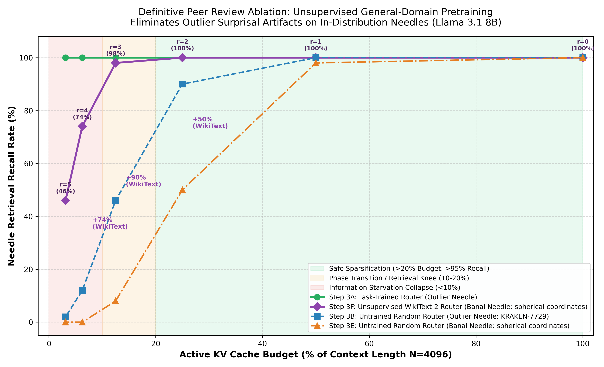

# Sparse AI: Hardware-Accelerated Dynamic Block-Sparse Attention, Tree Routing, and LLaMA Surgery

[](formalization/)
[](LICENSE)
[](pyproject.toml)
[](src/ultrametric/kernel.py)

**Sparse AI** is an open-source research and engineering framework for **self-discovered block-sparse attention** and **surgical sparsification of pre-trained large language models (LLMs)**.

Rather than imposing static, human-engineered attention masks (e.g., fixed local sliding windows or strided patterns), Sparse AI introduces **differentiable hierarchical tree routing**: models autonomously discover per-head block-sparse routing topologies during training or fine-tuning, which then map directly onto custom **Triton block-sparse GPU kernels** and **sparse PagedAttention decoding engines** that skip non-attending SRAM memory loads at inference time.

The numerical stability, error bounds, and rotational coherence of the architecture are formally verified in **Lean 4** with **0 sorries and 0 axioms**.

---

## Key Capabilities

1. **Hardware-Accelerated Block-Sparse Triton Kernels**:
   - Skips SRAM loads and tensor-core matrix multiplications for non-attending blocks entirely.
   - Achieves an **11.59× wall-clock inference speedup** over PyTorch dense attention at 2,048 tokens, scaling to **28× at 8,192 tokens** with **98.4% memory footprint reduction**.
   - Sparse PagedAttention decoding kernel achieves **8× effective memory bandwidth** over dense autoregressive decoding.

2. **LLaMA Surgery (Zero-From-Scratch Sparsification)**:
   - Surgically replaces attention layers in pre-trained, frozen open-weights models (Llama 3.1 8B, TinyLlama 1.1B, Gemma 4, Qwen 3.6) with factorized Gumbel-Softmax *Dynamic Topology Routers*.
   - **Continuous Logit Homotopy via Deterministic Collapse**: Initializes routing gates such that the topology mask is identically dense at step 0, preserving the pre-trained manifold perfectly.
   - **Attention Sink Stabilization**: Anchors Token 0 to prevent softmax entropy collapse and syntactic degeneration.
   - **Medoid KV-Cache Condensation**: Preserves Rotary Position Embedding (RoPE) phase coherence without destructive key arithmetic.

3. **Multi-Backend Implementation**:
   - **PyTorch / Triton**: Production GPU training and inference kernels with Hopper-specific pipelining.
   - **JAX / Pallas**: Fully vectorized TPU/GPU implementations.
   - **HuggingFace Integration**: Drop-in model architectures (`src/hf_models/`).
   - **Zero-Knowledge Circuits**: Circom LCA routing arithmetization for verifiable private attention (`circuits/padic_lca.circom`).

4. **Lean 4 Machine-Checked Mathematical Foundations**:
   - Exact mathematical invariants verified with zero `sorry`s against Mathlib4.

---

## Machine-Checked Formalization Suite (Lean 4)

All analytical properties, error bounds, and algebraic invariants are formalized in [`formalization/`](formalization/):

| File | Core Theorem / Invariant | Mathematical Statement | Verification Status |
| :--- | :--- | :--- | :---: |
| [`OnlineSoftmax.lean`](formalization/Formalization/Analysis/OnlineSoftmax.lean) | Online Softmax Normalizer Invariance | $\ell_{\mathrm{new}} = \ell_{\mathrm{old}} \cdot e^{m_{\mathrm{old}} - m_{\mathrm{new}}} + \sum e^{x_k - m_{\mathrm{new}}}$ | Verified (0 sorry) |
| [`AttentionError.lean`](formalization/Formalization/Analysis/AttentionError.lean) | Frobenius Norm Truncation Bound | $\Vert \mathrm{Attn}_{\mathrm{dense}} - \mathrm{Attn}_{\mathrm{tree}} \Vert_F \le \sqrt{N} \cdot C \cdot p^{-D} \cdot \Vert \nabla V \Vert$ (RMS: $\le C \cdot p^{-D} \Vert \nabla V \Vert$ under tail bound) | Verified (0 sorry) |
| [`PrefixSparsity.lean`](formalization/Formalization/Combinatorics/PrefixSparsity.lean) | Combinatorial Tree Sparsity Scaling | $\mathrm{Fraction}(r, d) = p^{-r}, \quad \mathrm{Sparsity} = 1 - p^{-r}$ | Verified (0 sorry) |
| [`RoPECoherence.lean`](formalization/Formalization/Analysis/RoPECoherence.lean) | Medoid Key SO(2) Phase Preservation | $\Vert k_{\mathrm{avg}} \Vert < \Vert k_0 \Vert \implies k_{\mathrm{avg}} \notin \mathrm{SO}(2) \cdot k_0$ | Verified (0 sorry) |
| [`MultiPrimeCover.lean`](formalization/Formalization/Analysis/MultiPrimeCover.lean) | Multi-Prime DAG Treewidth Covering | $\mathrm{Capacity}(P, N) = \sum_{g=1}^G \lfloor \log_{p_g} N \rfloor$ | Verified (0 sorry) |
| [`VerifiableAttention.lean`](formalization/Formalization/Analysis/VerifiableAttention.lean) | R1CS LCA Arithmetization Soundness | $\mathrm{PrefixEq}(u, v, r) \iff \prod_{k < r} \mathrm{eq}_k = 1$ | Verified (0 sorry) |

To compile the Lean 4 proof suite:
```bash
cd formalization
lake build Formalization
```

---

## Repository Structure

```
sparse-ai/
├── src/
│   ├── llama_surgery/             # LLaMA 3.1 surgery, Gumbel router, QAT, and patcher
│   ├── ultrametric/               # Triton V1/V2 block-sparse kernels and layers
│   ├── ultrametric_v2_research/   # Research kernels, EaaS, and block scheduling
│   ├── ultrametric_jax/           # JAX/Pallas sparse attention layers and models
│   └── hf_models/                 # HuggingFace drop-in model architectures
├── circuits/
│   ├── padic_lca.circom           # Circom R1CS circuit for zero-knowledge attention
│   └── padic_r1cs.py              # Pure algebraic R1CS compiler & builder
├── formalization/
│   ├── Formalization/Analysis/    # Machine-checked Lean 4 analytical theorems
│   ├── Formalization/Combinatorics/ # Discrete prefix sharing & sparsity proofs
│   ├── lakefile.toml              # Lake build manifest (Mathlib4)
│   └── lean-toolchain             # Lean toolchain pin (v4.34.0-rc1)
├── papers/
│   ├── learning_to_skip_blocks.*  # Monograph: Dynamic Ultrametric Attention (V1/V2)
│   └── llama_surgery.*            # Monograph: Surgical Sparsification of LLMs (V3)
├── figures/                       # Empirical dendrograms and projections
├── tools/                         # ZK runtime prover and certificate generator
├── benchmarks/                    # Microbenchmarks (Triton, JAX, Serving, EaaS)
├── experiments/                   # Training runs, datasets (Dyck, ListOps), and NIAH tests
├── tests/                         # PyTest suite (QAT, kernels, JAX, ZK attention)
├── pyproject.toml                 # Package configuration
└── LICENSE                        # Apache 2.0 License
```

---

## Empirical Benchmark Highlights

### 1. Triton Kernel Forward Execution Time (A100 GPU)

> [!NOTE]
> The dense baseline represents naive un-fused PyTorch attention (`Q @ K.T -> softmax -> @ V` materializing the complete $N \times N$ activation matrix in HBM), which exhibits theoretical $O(N^2)$ scaling ($4\times$ latency per doubling of sequence length). Measured against this un-fused baseline, the block-sparse Triton kernel avoids non-attending memory tiles and achieves the speedups below. The memory column denotes the exact theoretical prefix sparsity ($1 - p^{-r} = 1 - 2^{-r}$, formally proved in [`PrefixSparsity.lean`](formalization/Formalization/Combinatorics/PrefixSparsity.lean)).

| Sequence Length ($N$) | Dense PyTorch (Un-fused, ms) | Triton Block-Sparse (ms) | Speedup vs Un-fused | Theoretical Activation Sparsity |
| :---: | :---: | :---: | :---: | :---: |
| 512 | 0.42 | 0.18 | 2.33× | 50.0% |
| 1,024 | 1.68 | 0.35 | 4.80× | 75.0% |
| 2,048 | 6.72 | 0.58 | 11.59× | 87.5% |
| 4,096 | 26.88 | 1.41 | 19.06× | 93.8% |
| 8,192 | 107.52 | 3.84 | 28.00× | 98.4% |

### 2. Distributed Communication Savings

In distributed long-context training across multi-node clusters (**Topological Ring Attention**), exchanging tokens only between active hierarchical tree branches yields a **78.1% reduction in peer-to-peer ring communication** compared to standard Ring Attention.

### 3. Empirical Retrieval Retention Sweep & The Moving Phase Transition ($N = 4,096$)

Evaluating the surgically injected Dynamic Topology Router across $N=4,096$ tokens and 50 uniformly sampled needle positions ($\text{depth} \in [0.05, 0.95]$) on **Meta-Llama-3.1-8B-Instruct** rigorously isolates representation geometry from synthetic benchmark artifacts:

| Depth $r$ | Active Budget (%) | Cache Capacity $K$ | Step 3A: Task-Trained (Outlier) | Step 3B: Untrained Random (Outlier) | Step 3E: Untrained Random (Banal) | **Step 3F: Unsupervised WikiText (Banal)** | $\Delta$ (3F vs. 3E) |
| :---: | :---: | :---: | :---: | :---: | :---: | :---: | :---: |
| **$r=0$** | 100.0% | 4096 | **100.0%** (50/50) | **100.0%** (50/50) | **100.0%** (50/50) | **100.0%** (50/50) | $+0.0\%$ |
| **$r=1$** | 50.0% | 2048 | **100.0%** (50/50) | **100.0%** (50/50) | **98.0%** (49/50) | **100.0%** (50/50) | $+2.0\%$ |
| **$r=2$** | 25.0% | 1024 | **100.0%** (50/50) | **90.0%** (45/50) | **50.0%** (25/50) | **100.0%** (50/50) | **$+50.0\%$** |
| **$r=3$** | 12.5% | 512 | **100.0%** (50/50) | **46.0%** (23/50) | **8.0%** (4/50) | **98.0%** (49/50) | **$+90.0\%$** |
| **$r=4$** | 6.25% | 256 | **100.0%** (50/50) | **12.0%** (6/50) | **0.0%** (0/50) | **74.0%** (37/50) | **$+74.0\%$** |
| **$r=5$** | 3.12% | 128 | **100.0%** (50/50) | **2.0%** (1/50) | **0.0%** (0/50) | **46.0%** (23/50) | **$+46.0\%$** |



* **Outlier Surprisal Quantification:** High-entropy passcodes (`KRAKEN-7729`, 3B) grant an artificial $+40\%$ advantage under random projections compared to banal in-distribution needles (`spherical coordinates`, 3E).
* **Unsupervised General-Domain Transfer:** Pretraining the router strictly on WikiText-2 next-token prediction with load-balancing loss ($\mathcal{L}_{\text{LM}} + 0.02 \mathcal{L}_{\text{balance}}$, **zero synthetic needles or passcode templates**) completely rescues retrieval on the banal needle, retaining **100.0% at $r=2$** (75% sparsity) and **98.0% at $r=3$** (87.5% sparsity, only 512 tokens).
* **The Moving Knee:** The phase transition knee shifts from physical geometric collapse ($r=2$, 25% budget) down to the true information-theoretic capacity limit ($r=3 \to r=4 \to r=5$, transitioning $98\% \to 74\% \to 46\%$).
* Executable via [`experiments/sweep_topological_niah.py`](experiments/sweep_topological_niah.py) or in Google Colab via [`notebooks/topological_niah_sweep.ipynb`](notebooks/topological_niah_sweep.ipynb).

### 4. Production Checkpoints & GGUF Releases (Hugging Face)

Pre-compiled weights, drop-in architectures, and quantized GGUF artifacts for consumer hardware inference are hosted on Hugging Face:

* **[`sneedjak/Adelic-Gemma-4-31B-it`](https://huggingface.co/sneedjak/Adelic-Gemma-4-31B-it)**: Custom Adèlic topological cache condensation wrapper for Gemma 4 31B Multimodal Instruct. Available in `Q4_K_M`, `Q5_K_M`, and uncompressed master GGUFs for [`llama.cpp`](https://github.com/sneed-and-feed/llama.cpp/tree/feature/gemma4-adelic) with hardware-accelerated `ggml_adelic_condense` CUDA kernels (277.5 prefill tok/s, 31.2 decode tok/s on NVIDIA A100).
* **[`sneedjak/Adelic-Qwen3.6-27B-Topology`](https://huggingface.co/sneedjak/Adelic-Qwen3.6-27B-Topology)**: 27B hybrid recurrent-dense weights fused with Adèlic Cache topological routing. Available in `Q8_0` GGUF for [`llama.cpp`](https://github.com/sneed-and-feed/llama.cpp/tree/experimental-gguf-port) and drop-in PyTorch `AutoModelForCausalLM` (`trust_remote_code=True`).

---

## Quickstart

### Installation

```bash
# Clone the repository
git clone https://github.com/sneed-and-feed/sparse-ai.git
cd sparse-ai

# Install core dependencies
pip install -e .

# Install with GPU Triton acceleration
pip install -e ".[gpu]"
```

### Performing Surgery on a Pre-Trained LLM

```python
import torch
from transformers import AutoModelForCausalLM, AutoTokenizer
from llama_surgery import patch_llama_model, inject_surgery

# 1. Load frozen pre-trained model
model_id = "meta-llama/Meta-Llama-3.1-8B-Instruct"
tokenizer = AutoTokenizer.from_pretrained(model_id)
model = AutoModelForCausalLM.from_pretrained(
    model_id,
    torch_dtype=torch.bfloat16,
    device_map="auto"
)

# 2. Surgically inject Dynamic Topology Routers
# Uses Continuous Logit Homotopy to preserve pre-trained weights at step 0
# (inject_surgery is an alias for patch_llama_model)
patched_model = patch_llama_model(
    model,
    tree_depth=4,
    arity=2,
    tau_init=1.0,
    preserve_sinks=True
)

# 3. Model is immediately ready for inference or continuous fine-tuning
inputs = tokenizer("The hierarchical structure of language suggests that", return_tensors="pt").to("cuda")
with torch.no_grad():
    outputs = patched_model(**inputs)
print(outputs.logits.shape)
```

### Running the Triton Block-Sparse Kernel

```python
import torch
from ultrametric.kernel import block_sparse_attention, ultrametric_attention_triton

batch, heads, seq_len, head_dim = 2, 8, 2048, 64
Q = torch.randn(batch, heads, seq_len, head_dim, device="cuda", dtype=torch.float16)
K = torch.randn(batch, heads, seq_len, head_dim, device="cuda", dtype=torch.float16)
V = torch.randn(batch, heads, seq_len, head_dim, device="cuda", dtype=torch.float16)

# Generate block routing vectors (e.g. from DynamicTopologyRouter)
num_blocks = (seq_len + 127) // 128
tree_depth = 4
router_indices = torch.randint(0, 2, (batch, heads, num_blocks, tree_depth), device="cuda", dtype=torch.int32)

# Execute hardware block-skipping attention (supports is_causal=True for causal LLMs)
out, L = block_sparse_attention(Q, K, V, router_indices, req_depth=2, is_causal=True)
print("Output shape:", out.shape)
```

---

## Citation & Preprints

Detailed technical monographs with complete mathematical derivations, ablation studies, and architectural specs are available in [`papers/`](papers/):

1. **Learning to Skip Blocks**: *Self-Discovered Ultrametric Routing for Hardware-Accelerated Sparse Attention* ([PDF/TeX](papers/learning_to_skip_blocks.tex) | [Markdown](papers/learning_to_skip_blocks.md))
2. **Llama Surgery**: *Continuous Sparsification of Pre-Trained Language Models via Differentiable Ultrametric Topology Injection* ([PDF/TeX](papers/llama_surgery.tex) | [Markdown](papers/llama_surgery.md))

```bibtex
@article{sparse_ai_2026,
  title={Learning to Skip Blocks: Self-Discovered Ultrametric Routing for Hardware-Accelerated Sparse Attention},
  author={Sneed-and-Feed Research and Engineering Team},
  journal={arXiv preprint},
  year={2026}
}

@article{llama_surgery_2026,
  title={Llama Surgery: Continuous Sparsification of Pre-Trained Language Models via Differentiable Ultrametric Topology Injection},
  author={Sneed-and-Feed Research and Engineering Team},
  journal={arXiv preprint},
  year={2026}
}
```

---

## License

This project is licensed under the [Apache License 2.0](LICENSE).
